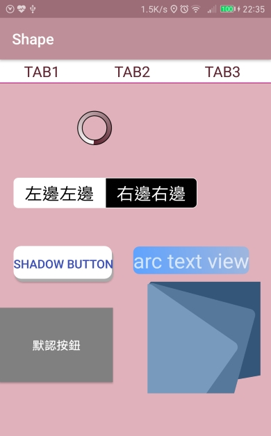

# Shape
Shape繪圖 (改自Android群英傳例題)

↓ shape 

* Tab1~3：radio button兼top bar。選擇後會出現紅底線條強調。
* 圈圈：progress bar。
* 左邊右邊：左邊和右邊是不同的繪圖組件，組合起來。
* Shadow button：按下會出現陰影
* arc text view：弧邊text view
* 默認按鈕：使用selector對靜態按鈕進行不同事件的反饋。(ex:初始狀態：按鈕背景灰色；觸碰狀態：亮藍色；非焦點狀態：亮黃色)
* 右下：layer-list 轉角度迭代做出類似紙張轉角度重疊的效果。

App download ↓
https://drive.google.com/open?id=0B0csiWXavBDHd2FCblhUazNZdEE
